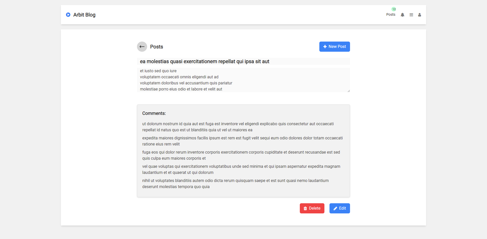

# React Arbit Blog


## Table of Contents
- [Introduction](#introduction)
- [Features](#features)
- [Technologies](#technologies)
- [Installation](#installation)
- [Usage](#usage)
- [State Management](#state-management)
- [Testing](#testing)
- [Deployment](#deployment)
- [Contributing](#contributing)
- [License](#license)

## Introduction

**React Arbit Blog** is a web application that allows users to manage their posts. It provides features for creating, reading, updating, and deleting posts. The project showcases the use of modern technologies such as React, Redux for state management, React Router for navigation, Axios for API calls, and Tailwind CSS for styling.



## Features

- View a list of posts with titles and summaries.
- Click on a post to read its full details, including comments.
- Create new posts.
- Update existing posts.
- Delete posts.

## Technologies

The project utilizes the following technologies:

- React: A popular JavaScript library for building user interfaces.
- Redux: A state management library for managing application state.
- React Router: A library for handling routing and navigation in React applications.
- Axios: A promise-based HTTP client for making API requests.
- Tailwind CSS: A utility-first CSS framework for designing responsive web applications.
- Font Awesome: A library of scalable vector icons that can be customized and styled.

## Installation

Follow these steps to set up and run the application on your local machine:

1. Clone the repository:

   ```bash
   git clone https://github.com/muhammadshiraz/react-arbit-blog.git

2. Navigate to the project directory:

   ```bash
   cd react-arbit-blog

3. Install project dependencies:

   ```bash
   npm install

4. Start the development server:

   ```bash
   npm start

The application will be accessible at http://localhost:3000 in your web browser.

## Usage

- Upon starting the application, you will see a list of posts.
- Click on a post to view its details, including comments.
- Use the "Create Post" button to add a new post.
- On the post details page, you can update or delete the post.

## State Management

Redux is employed for state management within the application. It handles data related to posts, user information, and comments, ensuring a consistent and efficient user experience.

## Testing

The project includes unit tests for components and Redux actions/reducers. You can execute the tests using the following command:
    ```bash
    npm test

## Deployment

You can deploy this application to various hosting services, such as Netlify, Vercel, or GitHub Pages. Follow standard deployment procedures for React applications to make your project accessible to a broader audience.

## Contributing

You can deploy this application to various hosting services, such as Netlify, Vercel, or GitHub Pages. Follow standard deployment procedures for React applications to make your project accessible to a broader audience

## License

This project is open-source and available under the MIT License. You are welcome to use, modify, and distribute it according to the terms of the license.

Enjoy using React Arbit Blog for your post management needs! Feel free to customize and extend it to suit your requirements.