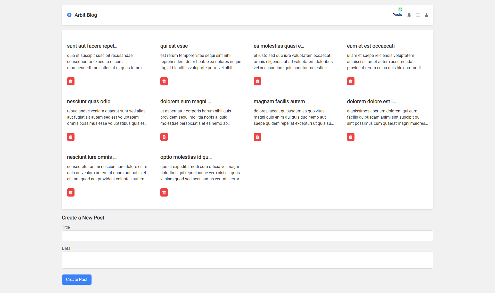

# React Arbit Blog

React Arbit Blog is a web application that enables users to manage their posts. It allows users to create, read, update, and delete posts. This project demonstrates the use of React, Redux for state management, React Router for navigation, Axios for API calls, and Tailwind CSS for styling.



## Features

- View a list of posts with titles and summaries.
- Click on a post to view its full details, including comments.
- Create new posts.
- Update existing posts.
- Delete posts.


## Table of Contents

- [Installation](#installation)
- [Usage](#usage)
- [Technologies Used](#technologies-used)
- [State Management](#state-management)
- [Tests](#tests)
- [Deployment](#deployment)
- [Contributing](#contributing)
- [License](#license)

## Installation

1. Clone the repository:

   ```bash
   git clone https://github.com/muhammadshiraz/react-arbit-blog.git

    Navigate to the project directory:
    cd react-arbit-blog
    
    Install dependencies:
    npm install
    
    Start the development server:
    npm start

The application will be available at http://localhost:3000 in your web browser.

